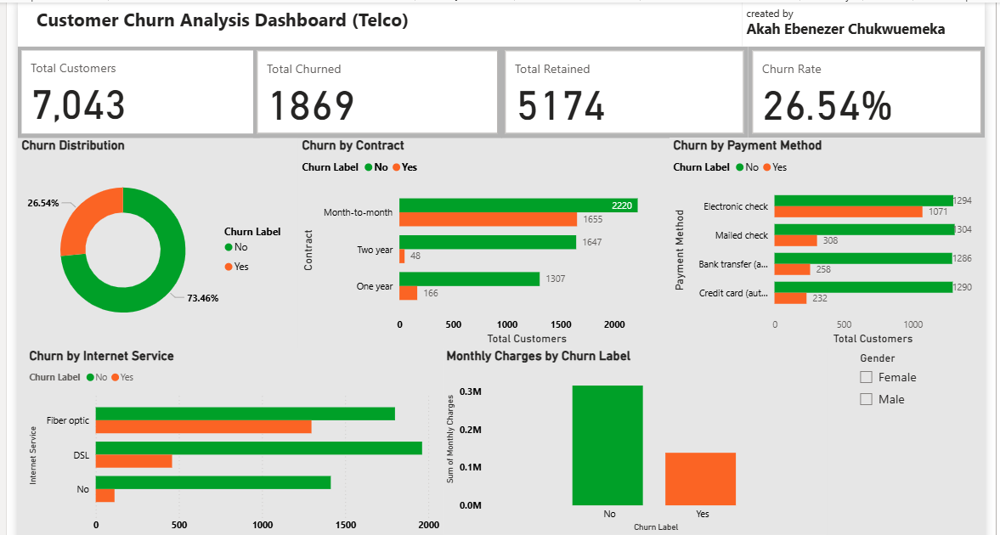

#Telco Customer Churn Analysis

Created by: Akah Ebenezer Chukwuemeka
Tools: PostgreSQL | Python | Power BI
Dataset: 7,043 telecom customers | 33 features

##Project Overview

Customer churn is one of the most critical challenges facing telecom companies. This end-to-end data analytics project analyzes a telco customer dataset to identify the key drivers of churn, uncover patterns, and present actionable business insights through an interactive Power BI dashboard.

##Business Questions Answered

What percentage of customers churned?
Which contract type has the highest churn rate?
Which payment method is most associated with churn?
Does internet service type influence churn?
Do churned customers pay higher monthly charges?

##Key Insights 

###Insight                                    Finding
Overall Churn Rate                    26.54% of customers churned
Highest Risk Contract          Month-to-month customers churn the most (1,655 churned)
Highest Risk Payment           Electronic check users have the highest churn (1,071 churned)
Highest Risk Service            Fiber optic internet customers churn more than DSL
Monthly Charges                Churned customers pay higher monthly charges on average
Retained Customers              5,174 (73.46%) customers were successfully retained

##Tools used

##Tool                                         Purpose
PostgreSQL / DBeaver              Data storage, exploration & SQL querying
Python / Jupyter Notebook          Data cleaning & exploratory visualization
Pandas                               Data manipulation and null handling
Matplotlib & Seaborn                  Python visualizations
Power BI                               Interactive dashboard creation
DAX                                     Custom measures and calculations

##Repository Structure

telco-customer-churn
│
├── data/
│   └── telco_churn_cleaned.csv       
│
├── sql/
│   └── telco_churn_queries.sql       # All SQL queries used
│
├── notebook/
│   └── telco_customer_churn.ipynb    # Python cleaning & visuals
│
├── dashboard/
│   ├── telco_customer_churn.pbix     # Power BI source file
│   └── telco_customer_churn.pdf      # Dashboard export (PDF)
│
└── README.md

##Project Workflow

Raw Data → PostgreSQL (Explore) → Python (Clean) → Power BI (Visualize)

##Step 1 — SQL Exploration (PostgreSQL/DBeaver)

Loaded dataset into PostgreSQL
Ran exploratory queries: churn distribution, contract type analysis, tenure grouping
Checked for NULL values and duplicate CustomerIDs
Confirmed data integrity before Python cleaning

##Step 2 — Data Cleaning (Python/Jupyter Notebook)

Loaded full dataset (7,043 rows × 33 columns) into Pandas DataFrame
Filled 1 NULL value in Churn Reason column with 'Unknown'
Dropped unnecessary columns: Count, Lat Long, Latitude, Longitude
Verified no remaining nulls across all columns
Exported cleaned data as telco_churn_cleaned.csv

##Step 3 — Dashboard (Power BI)

Imported cleaned CSV into Power BI
Created 4 DAX measures: Total Customers, Total Churned, Total Retained, Churn Rate
Built 6 visuals: KPI Cards, Donut chart, 3 Bar charts, Column chart
Added Gender slicer for interactive filtering

##Dashboard Preview

##DAX Measures Used

Total Customers = COUNTROWS(telco_churn_cleaned)

Total Churned = 
COUNTROWS(
    FILTER(telco_churn_cleaned, 
    telco_churn_cleaned[Churn Label] = "Yes")
)

Total Retained = 
COUNTROWS(
    FILTER(telco_churn_cleaned, 
    telco_churn_cleaned[Churn Label] = "No")
)

Churn Rate = DIVIDE([Total Churned], [Total Customers], 0)

##SQL Queries Highlights

-- Churn Distribution
SELECT "Churn Label", 
       COUNT(*) AS total,
       ROUND(COUNT() * 100.0 / SUM(COUNT()) OVER(), 2) AS percentage
FROM telco_customer_churn
GROUP BY "Churn Label";

-- Churn by Contract Type
SELECT "Contract", "Churn Label", COUNT(*) AS total
FROM telco_customer_churn
GROUP BY "Contract", "Churn Label"
ORDER BY "Contract";

-- Churn by Tenure Group
SELECT 
  CASE 
    WHEN "Tenure Months" <= 12 THEN '0-12 months'
    WHEN "Tenure Months" <= 24 THEN '13-24 months'
    WHEN "Tenure Months" <= 48 THEN '25-48 months'
    ELSE '49+ months'
  END AS tenure_group,
  "Churn Label", COUNT(*) AS total
FROM telco_customer_churn
GROUP BY tenure_group, "Churn Label"
ORDER BY tenure_group;

##How to Use This Project

Clone this repository
Open telco_churn_queries.sql in PostgreSQL/DBeaver to explore raw data
Open telco_customer_churn.ipynb in Jupyter Notebook to view cleaning steps
Open telco_customer_churn.pbix in Power BI Desktop to interact with the dashboard

##About the Author

Akah Ebenezer Chukwuemeka
Data Analyst | Founder of Mekuzhandy Tech Academy
Passionate about turning raw data into actionable business insights. Skilled in SQL, Python, and Power BI with a background in Library and Information Science.
📧 https://www.linkedin.com/in/akah-ebenezer-349a56219?utm_source=share_via&utm_content=profile&utm_medium=member_android
🌐 https://github.com/akah-ebenezer

